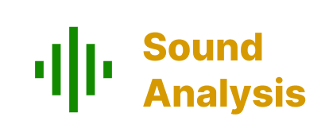

**Note**: Sound Analysis is only supported by iOS 15 or later

## Installation
1.open Terminal App<br>
2.cd [your project's folder]<br>
3.flutter add pub sound_analysis

## Usage
```
     import 'package:sound_analysis/sound_analysis.dart';
     import 'package:path/path.dart' as path;
     import 'package:path_provider/path_provider.dart';
    
     List<String> audios = await SoundAnalysis.knownClassifications(SoundAnalysis.SNClassifierIdentifier_version1);
     print("audios === ${audios}");
 
      Directory directory = await getApplicationDocumentsDirectory();
      var videoFilePath = path.join(directory.path,"t2.mp4");
      File file = File(videoFilePath);
      if (!file.existsSync()){
        ByteData data = await rootBundle.load("assets/t2.mp4");
        List<int> bytes = data.buffer.asUint8List(data.offsetInBytes, data.lengthInBytes);
        file.writeAsBytesSync(bytes,flush: true);
      }
      List<Map<String,dynamic>> clips = await SoundAnalysis.analyzeAudioFile(SoundAnalysis.SNClassifierIdentifier_version1, videoFilePath);
      print("audio clips:${clips}");
   
```
    
